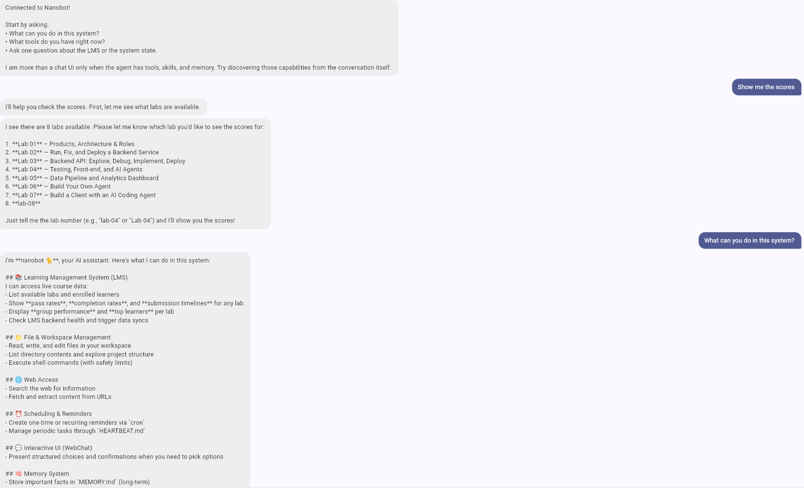
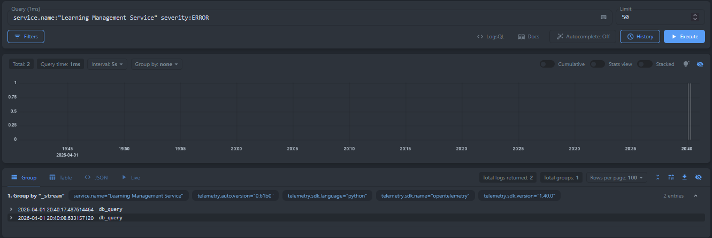
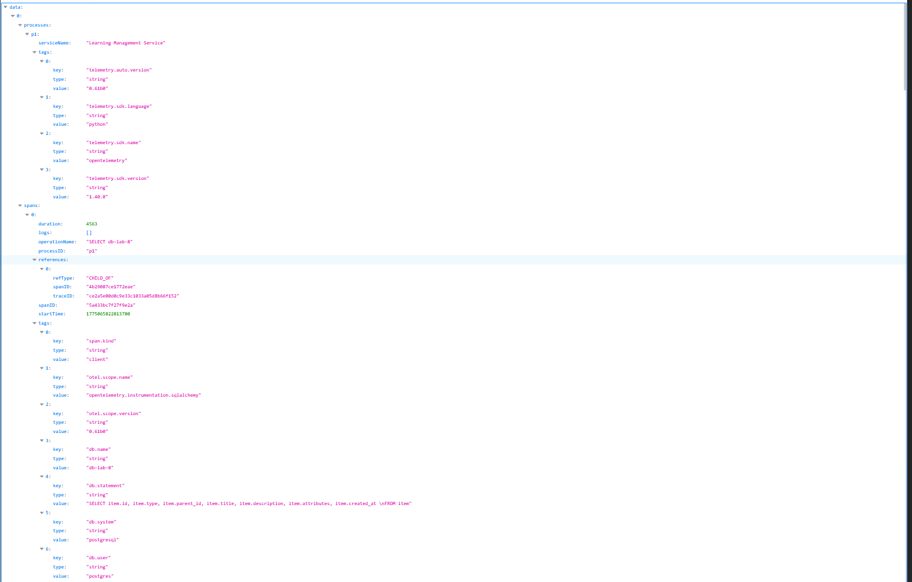
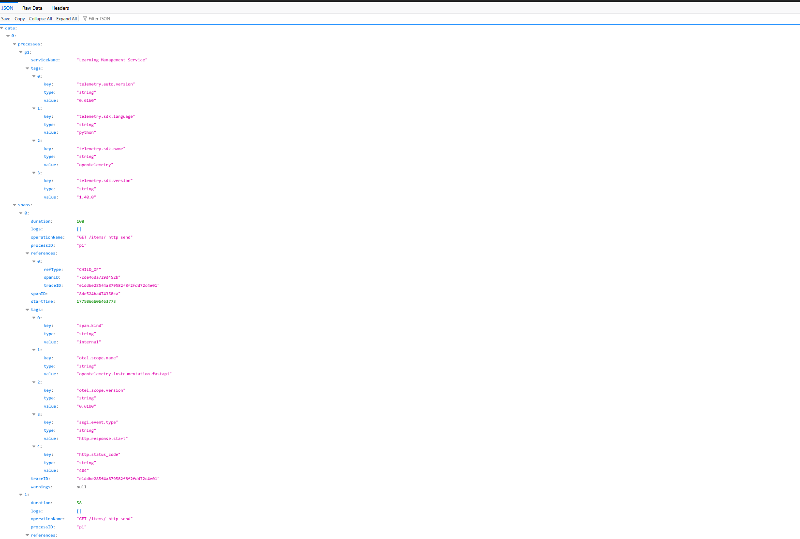
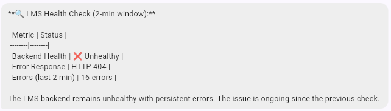

# Lab 8 — Report

Paste your checkpoint evidence below. Add screenshots as image files in the repo and reference them with ``.

## Task 1A — Bare agent

<!-- Paste the agent's response to "What is the agentic loop?" and "What labs are available in our LMS?" -->
The agentic loop is the core reasoning cycle that autonomous AI agents use to accomplish tasks. It  
consists of four main stages that repeat until a goal is achieved:

The Loop

 1 Perceive — Take in information from the environment (user input, tool results, file contents, API
   responses)
 2 Reason — Process the information, evaluate options, and decide what to do next
 3 Act — Execute actions using available tools (read/write files, run commands, make API calls, send
   messages)
 4 Observe — Receive feedback from the actions (outputs, errors, state changes)

Then the loop repeats with the new information.

Visual Flow

 Perceive → Reason → Act → Observe → (back to Perceive)

Why It Matters

This loop enables agents to:

 • Break complex tasks into manageable steps
 • Adapt when things don't go as planned
 • Learn from feedback and adjust strategy
 • Work autonomously toward a goal

As nanobot, I follow this loop for every task you give me. For example, if you ask me to "set up a  
project," I'll perceive your request, reason about the steps needed, act by creating files and
running commands, observe the results, and continue until the project is set up.

Based on the workspace, Lab 8 — The Agent is the Interface is the available lab in this LMS.

Required Tasks:

 Task  Description
 ─────────────────────────────────────────────────────────────────────────────────────
 1     Set Up the Agent — install nanobot, configure Qwen API, add MCP tools
 2     Deploy and Connect a Web Client — Dockerize nanobot, add WebSocket + Flutter UI
 3     Give the Agent New Eyes — build log/trace MCP tools for observability
 4     Diagnose a Failure — investigate, schedule health checks, fix a bug

Optional Tasks:

 Task  Description
 ─────────────────────────────────────────────────────────────────
 1     Add a Telegram Bot Client — same agent, different interface

The LMS backend provides APIs for items, interactions, and learners, backed by PostgreSQL. The lab  
focuses on building nanobot as an AI agent interface to query this system and observability data.

Would you like details on a specific task?

## Task 1B — Agent with LMS tools

<!-- Paste the agent's response to "What labs are available?" and "Describe the architecture of the LMS system" -->
Here are the available labs:

 1 Lab 01 – Products, Architecture & Roles
 2 Lab 02 — Run, Fix, and Deploy a Backend Service
 3 Lab 03 — Backend API: Explore, Debug, Implement, Deploy
 4 Lab 04 — Testing, Front-end, and AI Agents
 5 Lab 05 — Data Pipeline and Analytics Dashboard
 6 Lab 06 — Build Your Own Agent
 7 Lab 07 — Build a Client with an AI Coding Agent
 8 lab-08

Is there a specific lab you'd like to explore or get more information about?

Yes, the LMS backend is healthy. It currently has 56 items in the system and no errors reported.

## Task 1C — Skill prompt

<!-- Paste the agent's response to "Show me the scores" (without specifying a lab) -->
I'll help you check the scores. First, let me see what labs are available in the LMS.
2026-03-31 18:29:43.262 | INFO     | nanobot.agent.loop:_prepare_tools:253 - Tool call: mcp_lms_lms_labs({})

🐈 nanobot
There are 8 labs available. Which lab would you like to see the scores for? Here are the options:

 1 Lab 01 – Products, Architecture & Roles
 2 Lab 02 — Run, Fix, and Deploy a Backend Service
 3 Lab 03 — Backend API: Explore, Debug, Implement, Deploy
 4 Lab 04 — Testing, Front-end, and AI Agents
 5 Lab 05 — Data Pipeline and Analytics Dashboard
 6 Lab 06 — Build Your Own Agent
 7 Lab 07 — Build a Client with an AI Coding Agent
 8 lab-08

Please let me know which lab you're interested in, or if you'd like to see scores for all labs.

## Task 2A — Deployed agent

<!-- Paste a short nanobot startup log excerpt showing the gateway started inside Docker -->
nanobot-1  | ✓ Channels enabled: webchat
nanobot-1  | ✓ Heartbeat: every 1800s
nanobot-1  | 2026-04-01 16:52:09.448 | INFO     | nanobot.cron.service:_load_store:85 - Cron: jobs.json modified externally, reloading
nanobot-1  | 2026-04-01 16:52:09.448 | INFO     | nanobot.cron.service:start:202 - Cron service started with 0 jobs
nanobot-1  | 2026-04-01 16:52:09.448 | INFO     | nanobot.heartbeat.service:start:124 - Heartbeat started (every 1800s)
nanobot-1  | 2026-04-01 16:52:09.783 | INFO     | nanobot.channels.manager:start_all:91 - Starting webchat channel...
nanobot-1  | 2026-04-01 16:52:09.783 | INFO     | nanobot.channels.manager:_dispatch_outbound:119 - Outbound dispatcher started
nanobot-1  | 2026-04-01 16:52:11.451 | DEBUG    | nanobot.agent.tools.mcp:connect_mcp_servers:226 - MCP: registered tool 'mcp_lms_lms_health' from server 'lms'
nanobot-1  | 2026-04-01 16:52:11.451 | DEBUG    | nanobot.agent.tools.mcp:connect_mcp_servers:226 - MCP: registered tool 'mcp_lms_lms_labs' from server 'lms'
nanobot-1  | 2026-04-01 16:52:11.451 | DEBUG    | nanobot.agent.tools.mcp:connect_mcp_servers:226 - MCP: registered tool 'mcp_lms_lms_learners' from server 'lms'
nanobot-1  | 2026-04-01 16:52:11.451 | DEBUG    | nanobot.agent.tools.mcp:connect_mcp_servers:226 - MCP: registered tool 'mcp_lms_lms_pass_rates' from server 'lms'
nanobot-1  | 2026-04-01 16:52:11.451 | DEBUG    | nanobot.agent.tools.mcp:connect_mcp_servers:226 - MCP: registered tool 'mcp_lms_lms_timeline' from server 'lms'
nanobot-1  | 2026-04-01 16:52:11.451 | DEBUG    | nanobot.agent.tools.mcp:connect_mcp_servers:226 - MCP: registered tool 'mcp_lms_lms_groups' from server 'lms'
nanobot-1  | 2026-04-01 16:52:11.451 | DEBUG    | nanobot.agent.tools.mcp:connect_mcp_servers:226 - MCP: registered tool 'mcp_lms_lms_top_learners' from server 'lms'
nanobot-1  | 2026-04-01 16:52:11.451 | DEBUG    | nanobot.agent.tools.mcp:connect_mcp_servers:226 - MCP: registered tool 'mcp_lms_lms_completion_rate' from server 'lms'
nanobot-1  | 2026-04-01 16:52:11.451 | DEBUG    | nanobot.agent.tools.mcp:connect_mcp_servers:226 - MCP: registered tool 'mcp_lms_lms_sync_pipeline' from server 'lms'
nanobot-1  | 2026-04-01 16:52:11.451 | INFO     | nanobot.agent.tools.mcp:connect_mcp_servers:246 - MCP server 'lms': connected, 9 tools registered
nanobot-1  | 2026-04-01 16:52:12.990 | DEBUG    | nanobot.agent.tools.mcp:connect_mcp_servers:226 - MCP: registered tool 'mcp_mcp_webchat_ui_message' from server 'mcp_webchat'
nanobot-1  | 2026-04-01 16:52:12.991 | INFO     | nanobot.agent.tools.mcp:connect_mcp_servers:246 - MCP server 'mcp_webchat': connected, 1 tools registered
nanobot-1  | 2026-04-01 16:52:12.991 | INFO     | nanobot.agent.loop:run:280 - Agent loop started

## Task 2B — Web client

<!-- Screenshot of a conversation with the agent in the Flutter web app -->

Connected to Nanobot!

Start by asking:
• What can you do in this system?
• What tools do you have right now?
• Ask one question about the LMS or the system state.

I am more than a chat UI only when the agent has tools, skills, and memory. Try discovering those capabilities from the conversation itself.

Show me the scores

I see there are 8 labs available. Please let me know which lab you'd like to see the scores for:

1. **Lab 01** – Products, Architecture & Roles
2. **Lab 02** — Run, Fix, and Deploy a Backend Service
3. **Lab 03** — Backend API: Explore, Debug, Implement, Deploy
4. **Lab 04** — Testing, Front-end, and AI Agents
5. **Lab 05** — Data Pipeline and Analytics Dashboard
6. **Lab 06** — Build Your Own Agent
7. **Lab 07** — Build a Client with an AI Coding Agent
8. **lab-08**

Just tell me the lab number (e.g., "lab-04" or "Lab 04") and I'll show you the scores!

What can you do in this system?

I'm **nanobot 🐈**, your AI assistant. Here's what I can do in this system:

## 📚 Learning Management System (LMS)

I can access live course data:

- List available labs and enrolled learners
- Show **pass rates**, **completion rates**, and **submission timelines** for any lab
- Display **group performance** and **top learners** per lab
- Check LMS backend health and trigger data syncs

## 📁 File & Workspace Management

- Read, write, and edit files in your workspace
- List directory contents and explore project structure
- Execute shell commands (with safety limits)

## 🌐 Web Access

- Search the web for information
- Fetch and extract content from URLs

## ⏰ Scheduling & Reminders

- Create one-time or recurring reminders via `cron`
- Manage periodic tasks through `HEARTBEAT.md`

## 💬 Interactive UI (WebChat)

- Present structured choices and confirmations when you need to pick options

## 🧠 Memory System

- Store important facts in `MEMORY.md` (long-term)
- Log events in `HISTORY.md` (searchable event log)

## 🛠️ Skills

I have access to extensible skills including:

- **lms** – Course data and analytics
- **memory** – Two-layer memory with grep-style recall
- **cron** – Scheduled reminders and recurring tasks
- **structured-ui** – Interactive choice messages
- **clawhub** – Search and install new skills
- **skill-creator** – Create or update agent skills

---

**What would you like to do?** For example:

- "Show me the pass rates for lab-04"
- "Who are the top learners in lab-02?"
- "Set a reminder for tomorrow at 3pm"
- "What labs are available?"

## Task 3A — Structured logging

<!-- Paste happy-path and error-path log excerpts, VictoriaLogs query screenshot -->

{
  "trace_id": "a84f124e82eb8b402728795af1f59f86",
  "service": "Learning Management Service",
  "status": "success",
  "summary": {
    "endpoint": "GET /items/",
    "http_status": 200,
    "total_duration_ms": 97.7,
    "timestamp": "2026-04-01T19:16:11.165Z",
    "client": "python-httpx/0.28.1",
    "client_ip": "172.21.0.10:55662"
  },
  "spans": [
    {
      "span_id": "d169a068b33ba60d",
      "operation": "GET /items/",
      "kind": "server",
      "duration_ms": 97.7,
      "start_time": 1775068171165634,
      "tags": {
        "http.method": "GET",
        "http.url": "http://backend:8000/items/",
        "http.status_code": 200,
        "http.host": "172.21.0.7:8000"
      }
    },
    {
      "span_id": "63afa32567deb2f8",
      "operation": "connect",
      "kind": "client",
      "duration_ms": 60.5,
      "start_time": 1775068171168851,
      "tags": {
        "db.system": "postgresql",
        "db.name": "db-lab-8",
        "db.user": "postgres",
        "net.peer.name": "postgres",
        "net.peer.port": 5432
      }
    },
    {
      "span_id": "accc5ebfc1484d94",
      "operation": "BEGIN;",
      "kind": "client",
      "duration_ms": 5.0,
      "start_time": 1775068171230218,
      "tags": {
        "db.system": "postgresql",
        "db.statement": "BEGIN;"
      }
    },
    {
      "span_id": "63ed0d661991c7a1",
      "operation": "SELECT db-lab-8",
      "kind": "client",
      "duration_ms": 30.2,
      "start_time": 1775068171230033,
      "tags": {
        "db.system": "postgresql",
        "db.name": "db-lab-8",
        "db.statement": "SELECT item.id, item.type, item.parent_id, item.title, item.description, item.attributes, item.created_at FROM item"
      }
    },
    {
      "span_id": "8bcc657f69d37366",
      "operation": "ROLLBACK;",
      "kind": "client",
      "duration_ms": 0.3,
      "start_time": 1775068171265821,
      "tags": {
        "db.system": "postgresql",
        "db.statement": "ROLLBACK;"
      }
    },
    {
      "span_id": "d7e9a9558d39508d",
      "operation": "GET /items/ http send",
      "kind": "internal",
      "duration_ms": 0.1,
      "start_time": 1775068171262535,
      "tags": {
        "http.status_code": 200,
        "asgi.event.type": "http.response.start"
      }
    }
  ],
  "errors": []
}

{
    "_msg": "request_completed",
    "_stream": "{service.name=\"Learning Management Service\",telemetry.auto.version=\"0.61b0\",telemetry.sdk.language=\"python\",telemetry.sdk.name=\"opentelemetry\",telemetry.sdk.version=\"1.40.0\"}",
    "_stream_id": "00000000000000004bfe2483b590ccd2aa73fe0838569f74",
    "_time": "2026-04-01T18:44:10.418708736Z",
    "duration_ms": "442",
    "event": "request_completed",
    "method": "GET",
    "otelServiceName": "Learning Management Service",
    "otelSpanID": "496d1c14cf17ba4e",
    "otelTraceID": "a2784dc95db6df8cab87efdfe293abb7",
    "otelTraceSampled": "true",
    "path": "/items/",
    "scope.name": "lms_backend.main",
    "scope.version": "unknown",
    "service.name": "Learning Management Service",
    "severity": "INFO",
    "span_id": "496d1c14cf17ba4e",
    "status": "404",
    "telemetry.auto.version": "0.61b0",
    "telemetry.sdk.language": "python",
    "telemetry.sdk.name": "opentelemetry",
    "telemetry.sdk.version": "1.40.0",
    "trace_id": "a2784dc95db6df8cab87efdfe293abb7"
}

backend-1  | 2026-04-01 17:23:04,025 INFO [lms_backend.main] [main.py:62] [trace_id=232fbd533088b61434541b78c293a0e5 span_id=98c1660ebe4221b2 resource.service.name=Learning Management Service trace_sampled=True] - request_started
backend-1  | 2026-04-01 17:23:04,026 INFO [lms_backend.auth] [auth.py:30] [trace_id=232fbd533088b61434541b78c293a0e5 span_id=98c1660ebe4221b2 resource.service.name=Learning Management Service trace_sampled=True] - auth_success
backend-1  | 2026-04-01 17:23:04,026 INFO [lms_backend.db.items] [items.py:16] [trace_id=232fbd533088b61434541b78c293a0e5 span_id=98c1660ebe4221b2 resource.service.name=Learning Management Service trace_sampled=True] - db_query
backend-1  | INFO:     172.21.0.10:47952 - "GET /items/ HTTP/1.1" 200 OK
backend-1  | 2026-04-01 17:23:04,029 INFO [lms_backend.main] [main.py:74] [trace_id=232fbd533088b61434541b78c293a0e5 span_id=98c1660ebe4221b2 resource.service.name=Learning Management Service trace_sampled=True] - request_completed
backend-1  | INFO:     172.21.0.10:47952 - "GET /items/ HTTP/1.1" 200

backend-1  | 2026-04-01 17:40:16,979 INFO [lms_backend.main] [main.py:62] [trace_id=ca742ac17f0139b3bb9b9cddf40d9429 span_id=d89855409d212f01 resource.service.name=Learning Management Service trace_sampled=True] - request_started
backend-1  | 2026-04-01 17:40:16,980 INFO [lms_backend.auth] [auth.py:30] [trace_id=ca742ac17f0139b3bb9b9cddf40d9429 span_id=d89855409d212f01 resource.service.name=Learning Management Service trace_sampled=True] - auth_success
backend-1  | 2026-04-01 17:40:16,981 INFO [lms_backend.db.items] [items.py:16] [trace_id=ca742ac17f0139b3bb9b9cddf40d9429 span_id=d89855409d212f01 resource.service.name=Learning Management Service trace_sampled=True] - db_query
backend-1  | 2026-04-01 17:40:17,487 ERROR [lms_backend.db.items] [items.py:23] [trace_id=ca742ac17f0139b3bb9b9cddf40d9429 span_id=d89855409d212f01 resource.service.name=Learning Management Service trace_sampled=True] - db_query
backend-1  | 2026-04-01 17:40:17,488 WARNING [lms_backend.routers.items] [items.py:23] [trace_id=ca742ac17f0139b3bb9b9cddf40d9429 span_id=d89855409d212f01 resource.service.name=Learning Management Service trace_sampled=True] - items_list_failed_as_not_found
backend-1  | 2026-04-01 17:40:17,489 INFO [lms_backend.main] [main.py:74] [trace_id=ca742ac17f0139b3bb9b9cddf40d9429 span_id=d89855409d212f01 resource.service.name=Learning Management Service trace_sampled=True] - request_completed
backend-1  | INFO:     172.21.0.10:37500 - "GET /items/ HTTP/1.1" 404
backend-1  | INFO:     172.21.0.10:37500 - "GET /items/ HTTP/1.1" 404 Not Found



## Task 3B — Traces

<!-- Screenshots: healthy trace span hierarchy, error trace -->

{"data":[{"processes": {"p1":{"serviceName":"Learning Management Service","tags": [{"key":"telemetry.auto.version","type":"string","value":"0.61b0"},{"key":"telemetry.sdk.language","type":"string","value":"python"},{"key":"telemetry.sdk.name","type":"string","value":"opentelemetry"},{"key":"telemetry.sdk.version","type":"string","value":"1.40.0"}]}},"spans": [{"duration":4563,"logs":[],"operationName":"SELECT db-lab-8","processID":"p1","references": [{"refType":"CHILD_OF","spanID":"4b29087ce1772eae","traceID":"ce2a5e00d0c9e33c1033a05d8b66f152"}],"spanID":"5a433bc7f27f9e2a","startTime":1775065822813780,"tags": [{"key":"span.kind","type":"string","value":"client"},{"key":"otel.scope.name","type":"string","value":"opentelemetry.instrumentation.sqlalchemy"},{"key":"otel.scope.version","type":"string","value":"0.61b0"},{"key":"db.name","type":"string","value":"db-lab-8"},{"key":"db.statement","type":"string","value":"SELECT item.id, item.type, item.parent_id, item.title, item.description, item.attributes, item.created_at \nFROM item"},{"key":"db.system","type":"string","value":"postgresql"},{"key":"db.user","type":"string","value":"postgres"},{"key":"net.peer.name","type":"string","value":"postgres"},{"key":"net.peer.port","type":"string","value":"5432"}],"traceID":"ce2a5e00d0c9e33c1033a05d8b66f152","warnings":null},{"duration":113,"logs":[],"operationName":"GET /items/ http send","processID":"p1","references": [{"refType":"CHILD_OF","spanID":"4b29087ce1772eae","traceID":"ce2a5e00d0c9e33c1033a05d8b66f152"}],"spanID":"1063432f78b46eff","startTime":1775065822821677,"tags": [{"key":"span.kind","type":"string","value":"internal"},{"key":"otel.scope.name","type":"string","value":"opentelemetry.instrumentation.fastapi"},{"key":"otel.scope.version","type":"string","value":"0.61b0"},{"key":"asgi.event.type","type":"string","value":"http.response.start"},{"key":"http.status_code","type":"string","value":"200"}],"traceID":"ce2a5e00d0c9e33c1033a05d8b66f152","warnings":null},{"duration":43,"logs":[],"operationName":"GET /items/ http send","processID":"p1","references": [{"refType":"CHILD_OF","spanID":"4b29087ce1772eae","traceID":"ce2a5e00d0c9e33c1033a05d8b66f152"}],"spanID":"34bb57dc8c957ca7","startTime":1775065822823075,"tags": [{"key":"span.kind","type":"string","value":"internal"},{"key":"otel.scope.name","type":"string","value":"opentelemetry.instrumentation.fastapi"},{"key":"otel.scope.version","type":"string","value":"0.61b0"},{"key":"asgi.event.type","type":"string","value":"http.response.body"}],"traceID":"ce2a5e00d0c9e33c1033a05d8b66f152","warnings":null},{"duration":27,"logs":[],"operationName":"GET /items/ http send","processID":"p1","references": [{"refType":"CHILD_OF","spanID":"4b29087ce1772eae","traceID":"ce2a5e00d0c9e33c1033a05d8b66f152"}],"spanID":"d9a1703f14193326","startTime":1775065822823282,"tags": [{"key":"span.kind","type":"string","value":"internal"},{"key":"otel.scope.name","type":"string","value":"opentelemetry.instrumentation.fastapi"},{"key":"otel.scope.version","type":"string","value":"0.61b0"},{"key":"asgi.event.type","type":"string","value":"http.response.body"}],"traceID":"ce2a5e00d0c9e33c1033a05d8b66f152","warnings":null},{"duration":345,"logs":[],"operationName":"connect","processID":"p1","references": [{"refType":"CHILD_OF","spanID":"4b29087ce1772eae","traceID":"ce2a5e00d0c9e33c1033a05d8b66f152"}],"spanID":"6d1c4b98cae17e62","startTime":1775065822812587,"tags": [{"key":"span.kind","type":"string","value":"client"},{"key":"otel.scope.name","type":"string","value":"opentelemetry.instrumentation.sqlalchemy"},{"key":"otel.scope.version","type":"string","value":"0.61b0"},{"key":"db.name","type":"string","value":"db-lab-8"},{"key":"db.system","type":"string","value":"postgresql"},{"key":"db.user","type":"string","value":"postgres"},{"key":"net.peer.name","type":"string","value":"postgres"},{"key":"net.peer.port","type":"string","value":"5432"}],"traceID":"ce2a5e00d0c9e33c1033a05d8b66f152","warnings":null},{"duration":15287,"logs":[],"operationName":"GET /items/","processID":"p1","references": [],"spanID":"4b29087ce1772eae","startTime":1775065822808091,"tags": [{"key":"span.kind","type":"string","value":"server"},{"key":"otel.scope.name","type":"string","value":"opentelemetry.instrumentation.fastapi"},{"key":"otel.scope.version","type":"string","value":"0.61b0"},{"key":"http.flavor","type":"string","value":"1.1"},{"key":"http.host","type":"string","value":"172.21.0.7:8000"},{"key":"http.method","type":"string","value":"GET"},{"key":"http.route","type":"string","value":"/items/"},{"key":"http.scheme","type":"string","value":"http"},{"key":"http.server_name","type":"string","value":"10.93.25.40:42002"},{"key":"http.target","type":"string","value":"/items/"},{"key":"http.url","type":"string","value":"http://10.93.25.40:42002/items/"},{"key":"http.user_agent","type":"string","value":"Mozilla/5.0 (Windows NT 10.0; Win64; x64; rv:149.0) Gecko/20100101 Firefox/149.0"},{"key":"net.host.port","type":"string","value":"8000"},{"key":"net.peer.ip","type":"string","value":"172.21.0.8"},{"key":"http.status_code","type":"string","value":"200"},{"key":"net.peer.port","type":"string","value":"39052"}],"traceID":"ce2a5e00d0c9e33c1033a05d8b66f152","warnings":null},{"duration":577,"logs":[],"operationName":"BEGIN;","processID":"p1","references": [{"refType":"CHILD_OF","spanID":"4b29087ce1772eae","traceID":"ce2a5e00d0c9e33c1033a05d8b66f152"}],"spanID":"3b7edb2b9e37243c","startTime":1775065822814118,"tags": [{"key":"span.kind","type":"string","value":"client"},{"key":"otel.scope.name","type":"string","value":"opentelemetry.instrumentation.asyncpg"},{"key":"otel.scope.version","type":"string","value":"0.61b0"},{"key":"db.name","type":"string","value":"db-lab-8"},{"key":"db.statement","type":"string","value":"BEGIN;"},{"key":"db.system","type":"string","value":"postgresql"},{"key":"db.user","type":"string","value":"postgres"},{"key":"net.peer.name","type":"string","value":"postgres"},{"key":"net.peer.port","type":"string","value":"5432"},{"key":"net.transport","type":"string","value":"ip_tcp"}],"traceID":"ce2a5e00d0c9e33c1033a05d8b66f152","warnings":null},{"duration":532,"logs":[],"operationName":"ROLLBACK;","processID":"p1","references": [{"refType":"CHILD_OF","spanID":"4b29087ce1772eae","traceID":"ce2a5e00d0c9e33c1033a05d8b66f152"}],"spanID":"275fd1a726b840e3","startTime":1775065822824267,"tags": [{"key":"span.kind","type":"string","value":"client"},{"key":"otel.scope.name","type":"string","value":"opentelemetry.instrumentation.asyncpg"},{"key":"otel.scope.version","type":"string","value":"0.61b0"},{"key":"db.name","type":"string","value":"db-lab-8"},{"key":"db.statement","type":"string","value":"ROLLBACK;"},{"key":"db.system","type":"string","value":"postgresql"},{"key":"db.user","type":"string","value":"postgres"},{"key":"net.peer.name","type":"string","value":"postgres"},{"key":"net.peer.port","type":"string","value":"5432"},{"key":"net.transport","type":"string","value":"ip_tcp"}],"traceID":"ce2a5e00d0c9e33c1033a05d8b66f152","warnings":null}],"traceID":"ce2a5e00d0c9e33c1033a05d8b66f152","warnings": null}],"errors":null,"limit": 0,"offset": 0,"total":1}

{"data":[{"processes": {"p1":{"serviceName":"Learning Management Service","tags": [{"key":"telemetry.auto.version","type":"string","value":"0.61b0"},{"key":"telemetry.sdk.language","type":"string","value":"python"},{"key":"telemetry.sdk.name","type":"string","value":"opentelemetry"},{"key":"telemetry.sdk.version","type":"string","value":"1.40.0"}]}},"spans": [{"duration":108,"logs":[],"operationName":"GET /items/ http send","processID":"p1","references": [{"refType":"CHILD_OF","spanID":"7cde46da729d452b","traceID":"e1ddbe285f4a879582f8f2fdd72c4e01"}],"spanID":"8de524ba474358ca","startTime":1775066606463773,"tags": [{"key":"span.kind","type":"string","value":"internal"},{"key":"otel.scope.name","type":"string","value":"opentelemetry.instrumentation.fastapi"},{"key":"otel.scope.version","type":"string","value":"0.61b0"},{"key":"asgi.event.type","type":"string","value":"http.response.start"},{"key":"http.status_code","type":"string","value":"404"}],"traceID":"e1ddbe285f4a879582f8f2fdd72c4e01","warnings":null},{"duration":58,"logs":[],"operationName":"GET /items/ http send","processID":"p1","references": [{"refType":"CHILD_OF","spanID":"7cde46da729d452b","traceID":"e1ddbe285f4a879582f8f2fdd72c4e01"}],"spanID":"54a65c86978bcec4","startTime":1775066606464961,"tags": [{"key":"span.kind","type":"string","value":"internal"},{"key":"otel.scope.name","type":"string","value":"opentelemetry.instrumentation.fastapi"},{"key":"otel.scope.version","type":"string","value":"0.61b0"},{"key":"asgi.event.type","type":"string","value":"http.response.body"}],"traceID":"e1ddbe285f4a879582f8f2fdd72c4e01","warnings":null},{"duration":44,"logs":[],"operationName":"GET /items/ http send","processID":"p1","references": [{"refType":"CHILD_OF","spanID":"7cde46da729d452b","traceID":"e1ddbe285f4a879582f8f2fdd72c4e01"}],"spanID":"bcb7e2022727e8d7","startTime":1775066606465261,"tags": [{"key":"span.kind","type":"string","value":"internal"},{"key":"otel.scope.name","type":"string","value":"opentelemetry.instrumentation.fastapi"},{"key":"otel.scope.version","type":"string","value":"0.61b0"},{"key":"asgi.event.type","type":"string","value":"http.response.body"}],"traceID":"e1ddbe285f4a879582f8f2fdd72c4e01","warnings":null},{"duration":301109,"logs":[{"timestamp":1775066606460962,"fields":[{"key":"exception.escaped","type":"string","value":"False"},{"key":"exception.message","type":"string","value":"[Errno -2] Name or service not known"},{"key":"exception.type","type":"string","value":"socket.gaierror"},{"key":"event","type":"string","value":"exception"},{"key":"exception.stacktrace","type":"string","value":"Traceback (most recent call last):\n  File \"/app/.venv/lib/python3.14/site-packages/opentelemetry/trace/**init**.py\", line 619, in use_span\n    yield span\n  File \"/app/.venv/lib/python3.14/site-packages/opentelemetry/sdk/trace/**init**.py\", line 1173, in start_as_current_span\n    yield span\n  File \"/app/.venv/lib/python3.14/site-packages/opentelemetry/instrumentation/sqlalchemy/engine.py\", line 129, in_wrap_connect_internal\n    return func(*args, **kwargs)\n  File \"/app/.venv/lib/python3.14/site-packages/sqlalchemy/engine/base.py\", line 3293, in connect\n    return self._connection_cls(self)\n           ~~~~~~~~~~~~~~~~~~~~^^^^^^\n  File \"/app/.venv/lib/python3.14/site-packages/sqlalchemy/engine/base.py\", line 143, in **init**\n    self._dbapi_connection = engine.raw_connection()\n                             ~~~~~~~~~~~~~~~~~~~~~^^\n  File \"/app/.venv/lib/python3.14/site-packages/sqlalchemy/engine/base.py\", line 3317, in raw_connection\n    return self.pool.connect()\n           ~~~~~~~~~~~~~~~~~^^\n  File \"/app/.venv/lib/python3.14/site-packages/sqlalchemy/pool/base.py\", line 448, in connect\n    return _ConnectionFairy._checkout(self)\n           ~~~~~~~~~~~~~~~~~~~~~~~~~~^^^^^^\n  File \"/app/.venv/lib/python3.14/site-packages/sqlalchemy/pool/base.py\", line 1272, in _checkout\n    fairy =_ConnectionRecord.checkout(pool)\n  File \"/app/.venv/lib/python3.14/site-packages/sqlalchemy/pool/base.py\", line 717, in checkout\n    with util.safe_reraise():\n         ~~~~~~~~~~~~~~~~~^^\n  File \"/app/.venv/lib/python3.14/site-packages/sqlalchemy/util/langhelpers.py\", line 121, in **exit**\n    raise exc_value.with_traceback(exc_tb)\n  File \"/app/.venv/lib/python3.14/site-packages/sqlalchemy/pool/base.py\", line 715, in checkout\n    dbapi_connection = rec.get_connection()\n  File \"/app/.venv/lib/python3.14/site-packages/sqlalchemy/pool/base.py\", line 866, in get_connection\n    self.__connect()\n    ~~~~~~~~~~~~~~^^\n  File \"/app/.venv/lib/python3.14/site-packages/sqlalchemy/pool/base.py\", line 900, in__connect\n    with util.safe_reraise():\n         ~~~~~~~~~~~~~~~~~^^\n  File \"/app/.venv/lib/python3.14/site-packages/sqlalchemy/util/langhelpers.py\", line 121, in **exit**\n    raise exc_value.with_traceback(exc_tb)\n  File \"/app/.venv/lib/python3.14/site-packages/sqlalchemy/pool/base.py\", line 896, in __connect\n    self.dbapi_connection = connection = pool._invoke_creator(self)\n                                         ~~~~~~~~~~~~~~~~~~~~^^^^^^\n  File \"/app/.venv/lib/python3.14/site-packages/sqlalchemy/engine/create.py\", line 665, in connect\n    return dialect.connect(*mutable_cargs,**mutable_cparams)\n           ~~~~~~~~~~~~~~~^^^^^^^^^^^^^^^^^^^^^^^^^^^^^^^^^^^\n  File \"/app/.venv/lib/python3.14/site-packages/sqlalchemy/engine/default.py\", line 630, in connect\n    return self.loaded_dbapi.connect(*cargs, **cparams)  # type: ignore[no-any-return]  # NOQA: E501\n           ~~~~~~~~~~~~~~~~~~~~~~~~~^^^^^^^^^^^^^^^^^^^\n  File \"/app/.venv/lib/python3.14/site-packages/sqlalchemy/dialects/postgresql/asyncpg.py\", line 955, in connect\n    await_only(creator_fn(*arg,**kw)),\n    ~~~~~~~~~~^^^^^^^^^^^^^^^^^^^^^^^^\n  File \"/app/.venv/lib/python3.14/site-packages/sqlalchemy/util/_concurrency_py3k.py\", line 132, in await_only\n    return current.parent.switch(awaitable)  # type: ignore[no-any-return,attr-defined] # noqa: E501\n           ~~~~~~~~~~~~~~~~~~~~~^^^^^^^^^^^\n  File \"/app/.venv/lib/python3.14/site-packages/sqlalchemy/util/_concurrency_py3k.py\", line 196, in greenlet_spawn\n    value = await result\n            ^^^^^^^^^^^^\n  File \"/app/.venv/lib/python3.14/site-packages/asyncpg/connection.py\", line 2443, in connect\n    return await connect_utils._connect(\n           ^^^^^^^^^^^^^^^^^^^^^^^^^^^^^\n    ...\u003c22 lines>...\n    )\n    ^\n  File \"/app/.venv/lib/python3.14/site-packages/asyncpg/connect_utils.py\", line 1249, in _connect\n    raise last_error or exceptions.TargetServerAttributeNotMatched(\n    ...\u003c2 lines>...\n    )\n  File \"/app/.venv/lib/python3.14/site-packages/asyncpg/connect_utils.py\", line 1218, in_connect\n    conn = await _connect_addr(\n           ^^^^^^^^^^^^^^^^^^^^\n    ...\u003c6 lines>...\n    )\n    ^\n  File \"/app/.venv/lib/python3.14/site-packages/asyncpg/connect_utils.py\", line 1054, in_connect_addr\n    return await__connect_addr(params, True, *args)\n           ^^^^^^^^^^^^^^^^^^^^^^^^^^^^^^^^^^^^^^^^^\n  File \"/app/.venv/lib/python3.14/site-packages/asyncpg/connect_utils.py\", line 1099, in __connect_addr\n    tr, pr = await connector\n             ^^^^^^^^^^^^^^^\n  File \"/app/.venv/lib/python3.14/site-packages/asyncpg/connect_utils.py\", line 969, in_create_ssl_connection\n    tr, pr = await loop.create_connection(\n             ^^^^^^^^^^^^^^^^^^^^^^^^^^^^^\n    ...\u003c2 lines>...\n        host, port)\n        ^^^^^^^^^^^\n  File \"uvloop/loop.pyx\", line 1982, in create_connection\nsocket.gaierror: [Errno -2] Name or service not known\n"}]}],"operationName":"connect","processID":"p1","references": [{"refType":"CHILD_OF","spanID":"7cde46da729d452b","traceID":"e1ddbe285f4a879582f8f2fdd72c4e01"}],"spanID":"86ca0e35ea218759","startTime":1775066606159902,"tags": [{"key":"span.kind","type":"string","value":"client"},{"key":"otel.scope.name","type":"string","value":"opentelemetry.instrumentation.sqlalchemy"},{"key":"otel.scope.version","type":"string","value":"0.61b0"},{"key":"db.name","type":"string","value":"db-lab-8"},{"key":"db.system","type":"string","value":"postgresql"},{"key":"db.user","type":"string","value":"postgres"},{"key":"net.peer.name","type":"string","value":"postgres"},{"key":"net.peer.port","type":"string","value":"5432"},{"key":"error","type":"string","value":"true"},{"key":"otel.status_description","type":"string","value":"gaierror: [Errno -2] Name or service not known"}],"traceID":"e1ddbe285f4a879582f8f2fdd72c4e01","warnings":null},{"duration":308271,"logs":[],"operationName":"GET /items/","processID":"p1","references": [],"spanID":"7cde46da729d452b","startTime":1775066606157136,"tags": [{"key":"span.kind","type":"string","value":"server"},{"key":"otel.scope.name","type":"string","value":"opentelemetry.instrumentation.fastapi"},{"key":"otel.scope.version","type":"string","value":"0.61b0"},{"key":"http.flavor","type":"string","value":"1.1"},{"key":"http.host","type":"string","value":"172.21.0.7:8000"},{"key":"http.method","type":"string","value":"GET"},{"key":"http.route","type":"string","value":"/items/"},{"key":"http.scheme","type":"string","value":"http"},{"key":"http.server_name","type":"string","value":"backend:8000"},{"key":"http.status_code","type":"string","value":"404"},{"key":"http.target","type":"string","value":"/items/"},{"key":"http.url","type":"string","value":"http://backend:8000/items/"},{"key":"http.user_agent","type":"string","value":"python-httpx/0.28.1"},{"key":"net.host.port","type":"string","value":"8000"},{"key":"net.peer.ip","type":"string","value":"172.21.0.10"},{"key":"net.peer.port","type":"string","value":"41386"}],"traceID":"e1ddbe285f4a879582f8f2fdd72c4e01","warnings":null}],"traceID":"e1ddbe285f4a879582f8f2fdd72c4e01","warnings": null}],"errors":null,"limit": 0,"offset": 0,"total":1}

## Task 3C — Observability MCP tools

<!-- Paste agent responses to "any errors in the last hour?" under normal and failure conditions -->
Yes, there were **5 errors** in the LMS backend in the last 10 minutes. Here's what I found:

## Errors Summary

| Trace ID | Error Type | Description |
|----------|------------|-------------|
| `e1ddbe285f4a879582f8f2fdd72c4e01` | `socket.gaierror` | DNS resolution failure: `[Errno -2] Name or service not known` when connecting to postgres |
| `4dcb759a99ffdc99beed48d1d49d31cc` | `asyncpg.InterfaceError` | `connection is closed` during a SELECT query |

## Details

**Most Critical Issue:**

- **DNS/Connection Failure**: The LMS backend failed to resolve the hostname `postgres` when attempting to connect to the database. This caused a `GET /items/` request to return a 404 error after a 308ms timeout.

**Secondary Issue:**

- **Closed Connection**: A SELECT query failed because the database connection was already closed, also resulting in a 404 response.

## Affected Requests

- `GET /items/` - returned 404 (multiple occurrences)
- Database: `db-lab-8` on `postgres:5432`

The errors appear to be related to **database connectivity issues** - either DNS resolution problems or connection pool instability. The service has since recovered (recent traces show successful 200 responses), but you may want to check:

1. PostgreSQL service health
2. Network/DNS configuration between backend and database
3. Connection pool settings

Yes, there are **11 errors** in the LMS backend in the last 10 minutes. Here's what I found:

## Main Issue: Database Connection Failures

The errors are caused by **DNS resolution failures** when trying to connect to PostgreSQL:

| Error Type | Count | Impact |
|------------|-------|--------|
| `socket.gaierror: [Errno -2] Name or service not known` | Multiple | Failed DB connections |
| HTTP 500 on `/pipeline/sync` | 1 | Sync pipeline failure |
| HTTP 404 on `/items/` | Several | Failed item requests |

## Root Cause

The backend service cannot resolve the hostname `postgres` (port 5432) consistently. The stack trace shows:

```
asyncpg.connect_utils → _connect_addr → socket.gaierror: [Errno -2] Name or service not known
```

This indicates a **networking/DNS issue** between the LMS backend container and the PostgreSQL database container.

## Affected Requests

- **POST /pipeline/sync** - Returned 500, failed to sync items
- **GET /items/** - Multiple 404 responses due to DB connection failures
- Some requests succeeded (HTTP 200) when the connection was available

## Recommendation

Check the Docker/Kubernetes networking configuration:

1. Verify the `postgres` service is running and healthy
2. Check DNS resolution within the backend container
3. Review network policies or service discovery configuration

## Task 4A — Multi-step investigation

<!-- Paste the agent's response to "What went wrong?" showing chained log + trace investigation -->
## Investigation Summary

**Log Evidence:**

- **18 errors** in the last 10 minutes
- Error type: `socket.gaierror: [Errno -2] Name or service not known`
- Service: **Learning Management Service** (backend)
- Event: `db_query` failed during PostgreSQL connection attempt

**Trace Evidence:**

- **Failed span**: `connect` to `postgres:5432` (duration: ~300-420ms, all failed)
- **HTTP span**: Returns `404` status code but root cause is DB connection failure
- **Database**: `db-lab-8`, user: `postgres`

**Affected Service:** Learning Management Service (backend)

**Root Failing Operation:** PostgreSQL connection — **DNS resolution failed** for hostname `postgres`

**Key Discrepancy:** The HTTP response returns `404 Not Found` but the actual error is a **database connection failure**. The backend error handler is misreporting DB connection errors as 404 instead of 503 (Service Unavailable).

---

## Root Cause

The LMS backend cannot connect to the PostgreSQL database because it cannot resolve the hostname `postgres`. This typically means:

1. **The PostgreSQL container/service is not running**
2. **Network connectivity issue** between the backend and database containers
3. **DNS/service discovery is not configured** properly in the container environment

The database hostname `postgres` is not resolvable, causing all LMS API requests that need database access to fail.

## Task 4B — Proactive health check

<!-- Screenshot or transcript of the proactive health report that appears in the Flutter chat -->
**🔍 LMS Health Check (2-min window):**

| Metric | Status |
|--------|--------|
| Backend Health | ❌ Unhealthy |
| Error Response | HTTP 404 |
| Errors (last 2 min) | 16 errors |

The LMS backend remains unhealthy with persistent errors. The issue is ongoing since the previous check.



## Task 4C — Bug fix and recovery

<!-- 1. Root cause identified
     2. Code fix (diff or description)
     3. Post-fix response to "What went wrong?" showing the real underlying failure
     4. Healthy follow-up report or transcript after recovery -->
