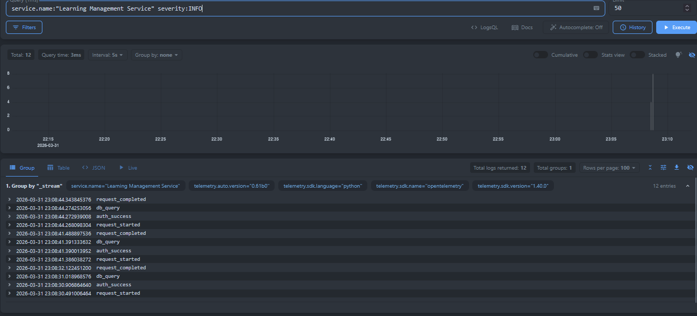

# Lab 8 — Report

Paste your checkpoint evidence below. Add screenshots as image files in the repo and reference them with ``.

## Task 1A — Bare agent

<!-- Paste the agent's response to "What is the agentic loop?" and "What labs are available in our LMS?" -->
The agentic loop is the core reasoning cycle that autonomous AI agents use to accomplish tasks. It  
consists of four main stages that repeat until a goal is achieved:

The Loop

 1 Perceive — Take in information from the environment (user input, tool results, file contents, API
   responses)
 2 Reason — Process the information, evaluate options, and decide what to do next
 3 Act — Execute actions using available tools (read/write files, run commands, make API calls, send
   messages)
 4 Observe — Receive feedback from the actions (outputs, errors, state changes)

Then the loop repeats with the new information.

Visual Flow

 Perceive → Reason → Act → Observe → (back to Perceive)

Why It Matters

This loop enables agents to:

 • Break complex tasks into manageable steps
 • Adapt when things don't go as planned
 • Learn from feedback and adjust strategy
 • Work autonomously toward a goal

As nanobot, I follow this loop for every task you give me. For example, if you ask me to "set up a  
project," I'll perceive your request, reason about the steps needed, act by creating files and
running commands, observe the results, and continue until the project is set up.

Based on the workspace, Lab 8 — The Agent is the Interface is the available lab in this LMS.

Required Tasks:

 Task  Description
 ─────────────────────────────────────────────────────────────────────────────────────
 1     Set Up the Agent — install nanobot, configure Qwen API, add MCP tools
 2     Deploy and Connect a Web Client — Dockerize nanobot, add WebSocket + Flutter UI
 3     Give the Agent New Eyes — build log/trace MCP tools for observability
 4     Diagnose a Failure — investigate, schedule health checks, fix a bug

Optional Tasks:

 Task  Description
 ─────────────────────────────────────────────────────────────────
 1     Add a Telegram Bot Client — same agent, different interface

The LMS backend provides APIs for items, interactions, and learners, backed by PostgreSQL. The lab  
focuses on building nanobot as an AI agent interface to query this system and observability data.

Would you like details on a specific task?

## Task 1B — Agent with LMS tools

<!-- Paste the agent's response to "What labs are available?" and "Describe the architecture of the LMS system" -->
Here are the available labs:

 1 Lab 01 – Products, Architecture & Roles
 2 Lab 02 — Run, Fix, and Deploy a Backend Service
 3 Lab 03 — Backend API: Explore, Debug, Implement, Deploy
 4 Lab 04 — Testing, Front-end, and AI Agents
 5 Lab 05 — Data Pipeline and Analytics Dashboard
 6 Lab 06 — Build Your Own Agent
 7 Lab 07 — Build a Client with an AI Coding Agent
 8 lab-08

Is there a specific lab you'd like to explore or get more information about?

Yes, the LMS backend is healthy. It currently has 56 items in the system and no errors reported.

## Task 1C — Skill prompt

<!-- Paste the agent's response to "Show me the scores" (without specifying a lab) -->
I'll help you check the scores. First, let me see what labs are available in the LMS.
2026-03-31 18:29:43.262 | INFO     | nanobot.agent.loop:_prepare_tools:253 - Tool call: mcp_lms_lms_labs({})

🐈 nanobot
There are 8 labs available. Which lab would you like to see the scores for? Here are the options:

 1 Lab 01 – Products, Architecture & Roles
 2 Lab 02 — Run, Fix, and Deploy a Backend Service
 3 Lab 03 — Backend API: Explore, Debug, Implement, Deploy
 4 Lab 04 — Testing, Front-end, and AI Agents
 5 Lab 05 — Data Pipeline and Analytics Dashboard
 6 Lab 06 — Build Your Own Agent
 7 Lab 07 — Build a Client with an AI Coding Agent
 8 lab-08

Please let me know which lab you're interested in, or if you'd like to see scores for all labs.

## Task 2A — Deployed agent

<!-- Paste a short nanobot startup log excerpt showing the gateway started inside Docker -->
backend-1  | 2026-03-31 15:18:47,179 INFO [lms_backend.main] [main.py:74] [trace_id=fb864135dae1714f827f1fffdebe6a9c span_id=9b9566ad6553ff22 resource.service.name=Learning Management Service trace_sampled=True] - request_completed
backend-1  | INFO:     172.21.0.8:53838  - "GET /items/ HTTP/1.1" 200 OK
backend-1  | INFO:     172.21.0.8:53838 - "GET /items/ HTTP/1.1" 200
backend-1  | 2026-03-31 15:29:43,276 INFO [lms_backend.main] [main.py:62] [trace_id=e17027ae2810c4e82f9fea35606f16aa span_id=70e50fed3ae682db resource.service.name=Learning Management Service trace_sampled=True] - request_started
backend-1  | 2026-03-31 15:29:43,278 INFO [lms_backend.auth] [auth.py:30] [trace_id=e17027ae2810c4e82f9fea35606f16aa span_id=70e50fed3ae682db resource.service.name=Learning Management Service trace_sampled=True] - auth_success
backend-1  | 2026-03-31 15:29:43,279 INFO [lms_backend.db.items] [items.py:16] [trace_id=e17027ae2810c4e82f9fea35606f16aa span_id=70e50fed3ae682db resource.service.name=Learning Management Service trace_sampled=True] - db_query
backend-1  | 2026-03-31 15:29:43,286 INFO [lms_backend.main] [main.py:74] [trace_id=e17027ae2810c4e82f9fea35606f16aa span_id=70e50fed3ae682db resource.service.name=Learning Management Service trace_sampled=True] - request_completed
backend-1  | INFO:     172.21.0.8:40776 - "GET /items/ HTTP/1.1" 200
backend-1  | INFO:     172.21.0.8:40776 - "GET /items/ HTTP/1.1" 200 OK
backend-1  | 2026-03-31 20:08:30,491 INFO [lms_backend.main] [main.py:62] [trace_id=cee4563393e690c17cb389e43e8c1c93 span_id=84bd791c94e15921 resource.service.name=Learning Management Service trace_sampled=True] - request_started
backend-1  | 2026-03-31 20:08:30,906 INFO [lms_backend.auth] [auth.py:30] [trace_id=cee4563393e690c17cb389e43e8c1c93 span_id=84bd791c94e15921 resource.service.name=Learning Management Service trace_sampled=True] - auth_success
backend-1  | 2026-03-31 20:08:31,018 INFO [lms_backend.db.items] [items.py:16] [trace_id=cee4563393e690c17cb389e43e8c1c93 span_id=84bd791c94e15921 resource.service.name=Learning Management Service trace_sampled=True] - db_query
backend-1  | 2026-03-31 20:08:32,122 INFO [lms_backend.main] [main.py:74] [trace_id=cee4563393e690c17cb389e43e8c1c93 span_id=84bd791c94e15921 resource.service.name=Learning Management Service trace_sampled=True] - request_completed
backend-1  | INFO:     172.21.0.8:41878 - "GET /items/ HTTP/1.1" 200 OK
backend-1  | INFO:     172.21.0.8:41878 - "GET /items/ HTTP/1.1" 200
backend-1  | 2026-03-31 20:08:41,386 INFO [lms_backend.main] [main.py:62] [trace_id=6a9b883c106c917ac4733a009f779d6c span_id=519f2b0cec5c959e resource.service.name=Learning Management Service trace_sampled=True] - request_started
backend-1  | 2026-03-31 20:08:41,390 INFO [lms_backend.auth] [auth.py:30] [trace_id=6a9b883c106c917ac4733a009f779d6c span_id=519f2b0cec5c959e resource.service.name=Learning Management Service trace_sampled=True] - auth_success
backend-1  | 2026-03-31 20:08:41,391 INFO [lms_backend.db.items] [items.py:16] [trace_id=6a9b883c106c917ac4733a009f779d6c span_id=519f2b0cec5c959e resource.service.name=Learning Management Service trace_sampled=True] - db_query
backend-1  | 2026-03-31 20:08:41,488 INFO [lms_backend.main] [main.py:74] [trace_id=6a9b883c106c917ac4733a009f779d6c span_id=519f2b0cec5c959e resource.service.name=Learning Management Service trace_sampled=True] - request_completed
backend-1  | INFO:     172.21.0.8:44616 - "GET /items/ HTTP/1.1" 200
backend-1  | INFO:     172.21.0.8:44616 - "GET /items/ HTTP/1.1" 200 OK
backend-1  | 2026-03-31 20:08:44,268 INFO [lms_backend.main] [main.py:62] [trace_id=7c4c853b0c9699a2d54a2fff3ae0da73 span_id=81f4568beac3d09a resource.service.name=Learning Management Service trace_sampled=True] - request_started
backend-1  | 2026-03-31 20:08:44,272 INFO [lms_backend.auth] [auth.py:30] [trace_id=7c4c853b0c9699a2d54a2fff3ae0da73 span_id=81f4568beac3d09a resource.service.name=Learning Management Service trace_sampled=True] - auth_success
backend-1  | 2026-03-31 20:08:44,274 INFO [lms_backend.db.items] [items.py:16] [trace_id=7c4c853b0c9699a2d54a2fff3ae0da73 span_id=81f4568beac3d09a resource.service.name=Learning Management Service trace_sampled=True] - db_query
backend-1  | 2026-03-31 20:08:44,343 INFO [lms_backend.main] [main.py:74] [trace_id=7c4c853b0c9699a2d54a2fff3ae0da73 span_id=81f4568beac3d09a resource.service.name=Learning Management Service trace_sampled=True] - request_completed
backend-1  | INFO:     172.21.0.8:44616 - "GET /items/ HTTP/1.1" 200
backend-1  | INFO:     172.21.0.8:44616 - "GET /items/ HTTP/1.1" 200 OK
backend-1  | 2026-03-31 20:17:14,209 INFO [lms_backend.main] [main.py:62] [trace_id=bed2bfd059b07f27c1bcd36b13fd3b1a span_id=9f28061b1fd3e97d resource.service.name=Learning Management Service trace_sampled=True] - request_started
backend-1  | 2026-03-31 20:17:14,234 INFO [lms_backend.main] [main.py:74] [trace_id=bed2bfd059b07f27c1bcd36b13fd3b1a span_id=9f28061b1fd3e97d resource.service.name=Learning Management Service trace_sampled=True] - request_completed
backend-1  | INFO:     172.21.0.1:38766 - "GET /health HTTP/1.1" 404
backend-1  | INFO:     172.21.0.1:38766 - "GET /health HTTP/1.1" 404 Not Found
backend-1  | 2026-03-31 20:17:25,032 INFO [lms_backend.main] [main.py:62] [trace_id=31df2dc66304717a16e5e8614af36a88 span_id=53df67f868ca3055 resource.service.name=Learning Management Service trace_sampled=True] - request_started
backend-1  | 2026-03-31 20:17:25,057 INFO [lms_backend.main] [main.py:74] [trace_id=31df2dc66304717a16e5e8614af36a88 span_id=53df67f868ca3055 resource.service.name=Learning Management Service trace_sampled=True] - request_completed
backend-1  | INFO:     172.21.0.1:51416 - "GET /docs HTTP/1.1" 200
backend-1  | INFO:     172.21.0.1:51416 - "GET /docs HTTP/1.1" 200 OK
backend-1  | 2026-03-31 20:17:37,241 INFO [lms_backend.main] [main.py:62] [trace_id=f2f1cdc46ce33932efa160cd57b04e42 span_id=740eab74b2024dea resource.service.name=Learning Management Service trace_sampled=True] - request_started
backend-1  | 2026-03-31 20:17:37,247 INFO [lms_backend.auth] [auth.py:30] [trace_id=f2f1cdc46ce33932efa160cd57b04e42 span_id=740eab74b2024dea resource.service.name=Learning Management Service trace_sampled=True] - auth_success
backend-1  | 2026-03-31 20:17:37,249 INFO [lms_backend.db.items] [items.py:16] [trace_id=f2f1cdc46ce33932efa160cd57b04e42 span_id=740eab74b2024dea resource.service.name=Learning Management Service trace_sampled=True] - db_query
backend-1  | 2026-03-31 20:17:37,306 INFO [lms_backend.main] [main.py:74] [trace_id=f2f1cdc46ce33932efa160cd57b04e42 span_id=740eab74b2024dea resource.service.name=Learning Management Service trace_sampled=True] - request_completed
backend-1  | INFO:     172.21.0.1:37006 - "GET /items/ HTTP/1.1" 200 OK
backend-1  | INFO:     172.21.0.1:37006 - "GET /items/ HTTP/1.1" 200
backend-1  | 2026-03-31 20:17:43,390 INFO [lms_backend.main] [main.py:62] [trace_id=fc4fd5ab933a7122e17218848cca3598 span_id=2f31b180988e53eb resource.service.name=Learning Management Service trace_sampled=True] - request_started
backend-1  | 2026-03-31 20:17:43,458 INFO [lms_backend.auth] [auth.py:30] [trace_id=fc4fd5ab933a7122e17218848cca3598 span_id=2f31b180988e53eb resource.service.name=Learning Management Service trace_sampled=True] - auth_success
backend-1  | 2026-03-31 20:17:44,208 INFO [lms_backend.main] [main.py:74] [trace_id=fc4fd5ab933a7122e17218848cca3598 span_id=2f31b180988e53eb resource.service.name=Learning Management Service trace_sampled=True] - request_completed
backend-1  | INFO:     172.21.0.1:48684 - "GET /items/1 HTTP/1.1" 200
backend-1  | INFO:     172.21.0.1:48684 - "GET /items/1 HTTP/1.1" 200 OK
backend-1  | 2026-03-31 20:17:51,238 INFO [lms_backend.main] [main.py:62] [trace_id=10662194ce1cea464dfdaad14e6e2f28 span_id=67f3e67b6c40cc0c resource.service.name=Learning Management Service trace_sampled=True] - request_started
backend-1  | 2026-03-31 20:17:51,241 INFO [lms_backend.main] [main.py:74] [trace_id=10662194ce1cea464dfdaad14e6e2f28 span_id=67f3e67b6c40cc0c resource.service.name=Learning Management Service trace_sampled=True] - request_completed
backend-1  | INFO:     172.21.0.1:33514 - "GET /labs/ HTTP/1.1" 404 Not Found
backend-1  | INFO:     172.21.0.1:33514 - "GET /labs/ HTTP/1.1" 404

## Task 2B — Web client

<!-- Screenshot of a conversation with the agent in the Flutter web app -->

## Task 3A — Structured logging

<!-- Paste happy-path and error-path log excerpts, VictoriaLogs query screenshot -->

## Task 3B — Traces

<!-- Screenshots: healthy trace span hierarchy, error trace -->

## Task 3C — Observability MCP tools

<!-- Paste agent responses to "any errors in the last hour?" under normal and failure conditions -->

## Task 4A — Multi-step investigation

<!-- Paste the agent's response to "What went wrong?" showing chained log + trace investigation -->

## Task 4B — Proactive health check

<!-- Screenshot or transcript of the proactive health report that appears in the Flutter chat -->

## Task 4C — Bug fix and recovery

<!-- 1. Root cause identified
     2. Code fix (diff or description)
     3. Post-fix response to "What went wrong?" showing the real underlying failure
     4. Healthy follow-up report or transcript after recovery -->
